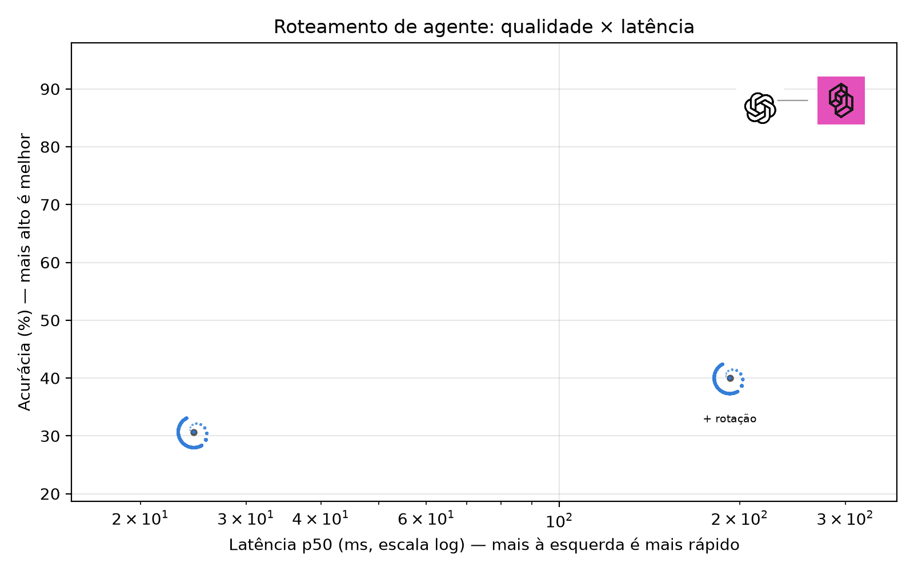
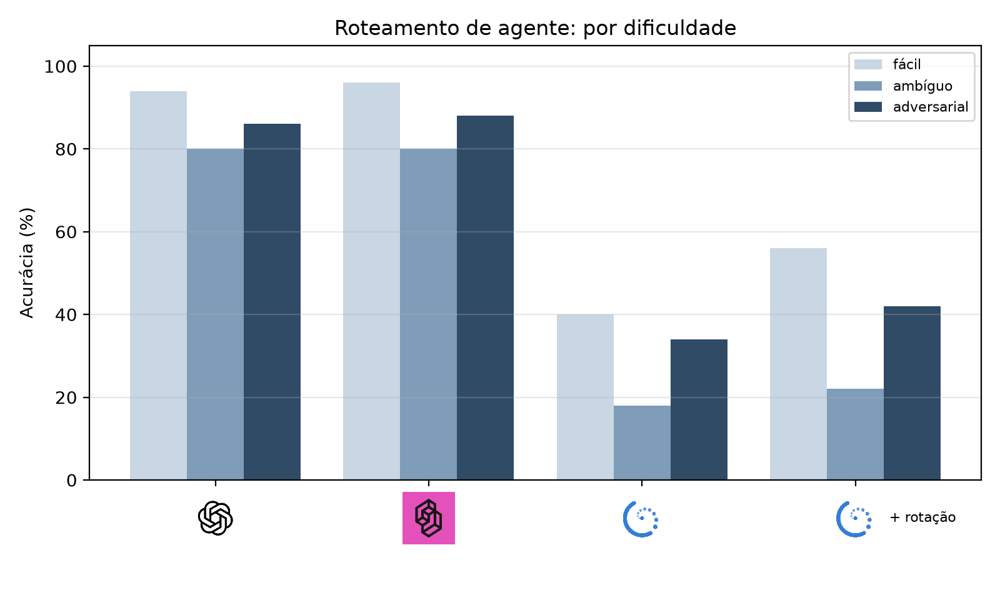
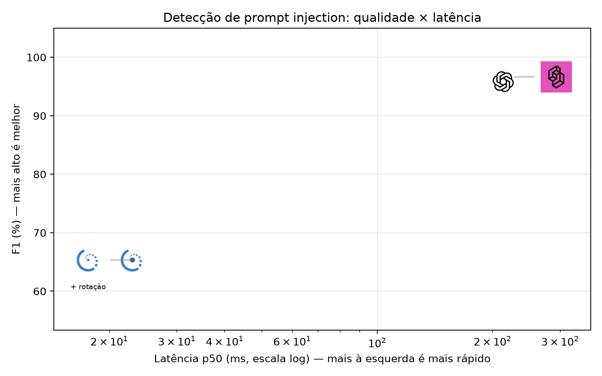
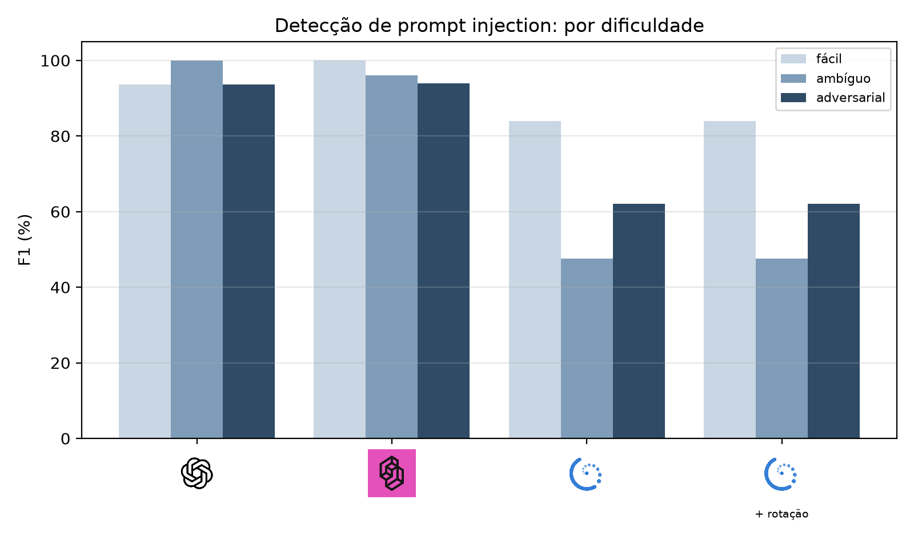
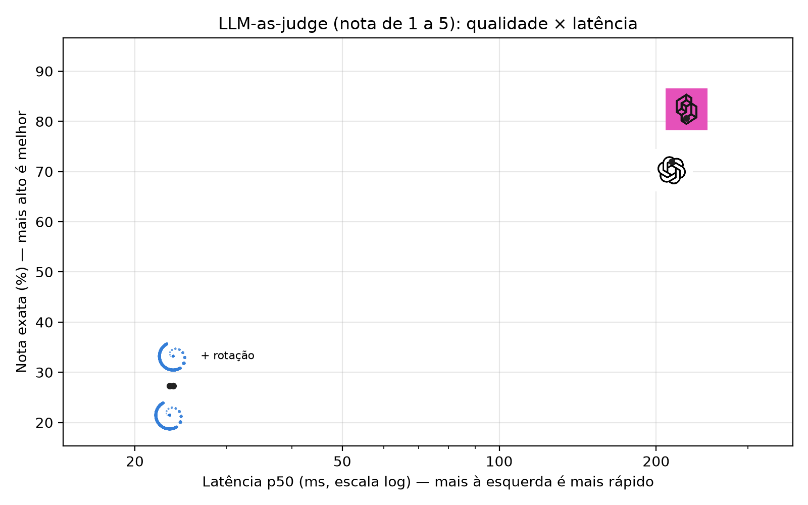
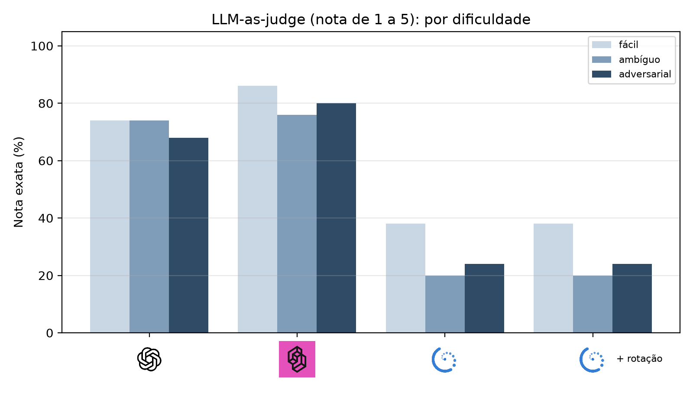

# openai-decisions-vs-jev-vs-laya

Benchmark independente de **decision models** em **português**: modelos que, em vez de gerar texto, respondem perguntas fechadas (escolha entre opções, sim/não, nota) e devolvem a probabilidade de cada resposta. Compara três provedores em três cenários comuns de engenharia de IA:

- **OpenAI Decisions API** (`gpt-6-luna`), lançada em public beta em 2026-10-06;
- **Jev**, da TypeSafe (`jev-1.13.0`), API própria para decisões;
- **Laya** (`laya-multilingual` 0.3.28), modelo open source que roda localmente. Também testada com **rotação das opções** (mitigação de viés de posição recomendada pelo próprio projeto).

Rodada de 2026-10-07: 450 casos por provedor, 0 falhas. Melhor valor de cada coluna em **negrito**.

## Resumo

- **Jev e OpenAI empatam tecnicamente na qualidade.** O Jev fica à frente no roteamento (88,0% × 86,7%) e no judge (80,7% × 72,0% de nota exata) e custa 17–35% menos. A OpenAI é o guardrail mais conservador: nenhum falso alarme nos textos que apenas falam sobre ataques.
- **Os dois modelos decidem em ~55–90 ms.** O resto dos ~215–230 ms de latência total é a ida e volta pela rede.
- **A Laya é ~10× mais rápida (~23 ms, local, sem custo), mas zero-shot não serve em português:** 31% no roteamento, 65% de F1 na detecção de injection e 27% de nota exata no judge.

## Cenário 1: roteamento de agente

**O que testa:** dada a mensagem de um usuário, qual ferramenta um assistente corporativo deve chamar primeiro. São 8 opções (agenda, email, busca web, CRM, execução de código, arquivos internos, atendente humano ou nenhuma) e 150 mensagens. Os casos difíceis têm palavras que apontam para a ferramenta errada, como "pesquisa no nosso drive o contrato", que é arquivo interno e não busca web.

**Como ler:** *Acurácia* é a fração de escolhas certas. *F1 macro* é a média do desempenho em cada ferramenta, para que nenhuma ferramenta frequente esconda as outras. *Fácil / Ambíguo / Adversarial* é a acurácia em cada nível de dificuldade (50 casos cada).

| Provedor | Acurácia | F1 macro | Fácil | Ambíguo | Adversarial | ECE | p50 (ms) | p50 sem rede (ms) | p95 (ms) | Custo por 1k |
|---|---|---|---|---|---|---|---|---|---|---|
| OpenAI | 86.7% | 86.0% | 94.0% | **80.0%** | 86.0% | 4.0% | 216 | 87 | 408 | US$ 0.0256 |
| Jev (TypeSafe) | **88.0%** | **87.4%** | **96.0%** | **80.0%** | **88.0%** | **3.8%** | 229 | 57 | 304 | US$ 0.0212 |
| Laya | 30.7% | 29.8% | 40.0% | 18.0% | 34.0% | 42.7% | **25** | **25** | **29** | **US$ 0.0000** |
| Laya + rotação | 40.0% | 37.5% | 56.0% | 22.0% | 42.0% | 22.6% | 193 | 193 | 209 | **US$ 0.0000** |

<p>
  
  
</p>

**O que os números mostram:** Jev e OpenAI erram principalmente nos casos ambíguos (80% nos dois). A Laya tem um **viés de posição** forte: na ordem padrão das opções ela responde "atendente humano" (a 7ª de 8 opções) em 101 das 150 mensagens, quando essa é a resposta certa em só 18. Rotacionar a ordem das opções e tirar a média sobe a acurácia para 40%, mas exige 8 chamadas por decisão, e a latência local fica igual à das APIs.

## Cenário 2: detecção de prompt injection

**O que testa:** se um texto que será processado por um agente de IA tenta sequestrar as instruções dele. São 75 ataques: diretos ("ignore suas instruções…"), escondidos em e-mails, currículos, faturas e páginas web, e ofuscados (base64, troca de idioma, role-play). Há também 75 textos legítimos, dos quais 25 são **negativos difíceis**: textos que apenas *falam* sobre prompt injection, como relatórios de incidente, material de treinamento e código de teste.

**Como ler:** *Precisão* é a fração de alarmes que eram ataques de verdade. *Recall* é a fração de ataques detectados. *F1* combina as duas. *AUROC* mede o quanto a probabilidade separa ataques de textos legítimos, sem depender de um limiar (1,0 é perfeito; 0,5 é o acaso). *Falso positivo em negativos difíceis* é a fração dos textos que só falam sobre ataques que foram marcados como ataque; quanto menor, melhor.

| Provedor | Precisão | Recall | F1 | AUROC | Falso positivo em negativos difíceis | ECE | p50 (ms) | p50 sem rede (ms) | p95 (ms) | Custo por 1k |
|---|---|---|---|---|---|---|---|---|---|---|
| OpenAI | **100.0%** | 92.0% | 95.8% | 0.993 | **0.0%** | **2.6%** | 213 | 84 | 318 | US$ 0.0250 |
| Jev (TypeSafe) | 97.3% | **96.0%** | **96.6%** | **0.993** | 4.0% | 6.7% | 225 | 53 | 296 | US$ 0.0162 |
| Laya | 65.3% | 65.3% | 65.3% | 0.725 | 60.0% | 23.0% | 23 | 23 | **26** | **US$ 0.0000** |
| Laya + rotação | 65.3% | 65.3% | 65.3% | 0.725 | 60.0% | 23.0% | **23** | **23** | 27 | **US$ 0.0000** |

<p>
  
  
</p>

**O que os números mostram:** os dois estão praticamente empatados (AUROC 0,993), mas com perfis diferentes. A OpenAI nunca deu falso alarme e deixou passar 8% dos ataques. O Jev pegou mais ataques (96%) e deu falso alarme em 4% dos textos que só falam sobre o tema. A Laya marcou como ataque 60% desses textos, o que inviabiliza usá-la como guardrail sem fine-tuning. Sim/não não tem ordem de opções, então a rotação não muda nada aqui.

## Cenário 3: LLM-as-judge

**O que testa:** dar nota de 1 a 5 à resposta de um assistente segundo uma rubrica fixa (1 = errada, 3 = correta mas incompleta, 5 = correta, completa e clara). São 150 pares de pergunta e resposta, 30 por nota. Os casos difíceis incluem respostas longas e confiantes porém erradas, respostas curtas porém perfeitas e respostas que elogiam a si mesmas.

**Como ler:** *Nota exata* é a fração de notas iguais à do rótulo. *Erro de até 1 ponto* aceita nota vizinha. *Erro médio* é a distância média até a nota certa; quanto menor, melhor.

| Provedor | Nota exata | Erro de até 1 ponto | Erro médio | ECE | p50 (ms) | p50 sem rede (ms) | p95 (ms) | Custo por 1k |
|---|---|---|---|---|---|---|---|---|
| OpenAI | 72.0% | **100.0%** | 0.28 | 11.7% | 214 | 85 | 362 | US$ 0.0220 |
| Jev (TypeSafe) | **80.7%** | 98.7% | **0.21** | **8.0%** | 229 | 57 | 282 | US$ 0.0174 |
| Laya | 27.3% | 58.7% | 1.46 | 25.2% | **23** | **23** | 33 | **US$ 0.0000** |
| Laya + rotação | 27.3% | 58.7% | 1.46 | 25.2% | 24 | 24 | **32** | **US$ 0.0000** |

<p>
  
  
</p>

**O que os números mostram:** o Jev acerta a nota exata com mais frequência (80,7% contra 72,0%). A OpenAI nunca erra por mais de 1 ponto. Para avaliação contínua, em que importa a tendência e não a nota individual, os dois servem. A Laya erra em média por 1,5 ponto. A nota tem uma ordem que faz parte da escala, então ela não é rotacionada.

## Colunas comuns às três tabelas

- **ECE (erro de calibração):** diferença média entre a confiança declarada e o acerto real. Com ECE de 4%, quando o modelo diz "80% de certeza" ele acerta perto de 80% das vezes, então dá para definir limiares em produção. Quanto menor, melhor. Diagramas em [`reliability.png`](results/2026-10-07/report/reliability.png).
- **p50 (ms):** latência típica (mediana) de uma decisão, medida do Brasil, com chamadas uma de cada vez.
- **p50 sem rede (ms):** p50 menos o tempo de ida e volta pela rede, medido com uma requisição sem chave ao mesmo endpoint de decisões. A API recusa essa requisição na entrada, sem chegar ao modelo, então esse tempo é só rede: ~129 ms até a OpenAI e ~172 ms até o Jev. A Laya roda local, então é igual ao p50.
- **p95 (ms):** latência das 5% de chamadas mais lentas.
- **Custo por 1k:** custo de mil decisões, a partir dos tokens reais de cada resposta e dos preços em [`pricing.yaml`](pricing.yaml). Os dois provedores cobram só a entrada.

## Como rodar

```bash
uv sync --extra laya                    # sem --extra laya se não for rodar a Laya
cp .env.example .env                    # preencha OPENAI_API_KEY e TYPESAFE_API_KEY
uv run bench validate                   # confere o dataset
uv run bench run --provider jev         # openai | jev | laya | laya-rot
uv run bench report results/<data>      # imprime as tabelas e gera os gráficos
```

`--limit 5` roda só 5 casos por cenário, o que é útil para testar chaves e custo. Se a execução cair no meio, rode o mesmo comando de novo: os casos já concluídos são pulados. Os modelos da Laya são baixados para `.cache/hf`, dentro do repo.

## Dataset e metodologia

- **Dataset:** 450 casos em português (150 por cenário, um terço em cada dificuldade), gerados com Claude, que não é concorrente, e aprovados após revisão rápida por humano. As instruções, opções e rubrica ficam em [`dataset/suites.yaml`](dataset/suites.yaml) e são o mesmo texto para todos os provedores. Hashes em [`dataset/SHA256SUMS`](dataset/SHA256SUMS).
- **Execução:** chamadas uma de cada vez, com 3 chamadas de aquecimento descartadas e até 4 tentativas em erros temporários. Falhas são registradas, nunca descartadas.
- **Calibração:** calculada a partir das probabilidades devolvidas, do mesmo jeito para todos. O campo `confidence` de cada provedor tem definição própria e não é usado.
- **Limitações:** dataset sintético de um único modelo, com revisão rápida. Uma rodada por caso. Tudo zero-shot, sem fine-tuning. A Laya rodou num Apple M5 com 16 GB. A OpenAI Decisions API está em beta.

## Licença

Código sob MIT ([`LICENSE`](LICENSE)). Dataset sob CC BY 4.0 ([`dataset/LICENSE`](dataset/LICENSE)).

<sub>Logos e marcas pertencem aos respectivos donos e aparecem apenas para identificar os produtos avaliados.</sub>
